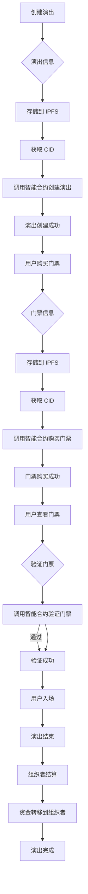

# show manager 合约

## 流程



## 结构体

```solidity
struct Show {
    uint256 id; // 演出 ID
    string name; // 演出名称
    string description; // 演出描述
    uint256 date; // 演出日期（时间戳）
    string location; // 演出地点
    uint256 totalTickets; // 总票数
    uint256 ticketsSold; // 已售票数
    uint256 ticketPrice; // 票价（以 wei 为单位）
    address organizer; // 组织者地址
    string ipfsCID; // IPFS CID
    bool isActive; // 演出是否激活
}

struct Organizer {
    uint256 id; // 组织者 ID
    address wallet; // 组织者钱包地址
    string name; // 组织者名称
    string did; // 组织者 DID
    bool isVerified; // 组织者是否已验证
}

struct Ticket {
    uint256 id; // 门票 ID
    uint256 showId; // 关联的演出 ID
    address owner; // 门票持有者地址
    bool isUsed; // 门票是否已使用
    bool canTransfer; // 门票是否可转让
    string ipfsCID; // IPFS CID
}

struct Token { //
    uint256 id; // 代币 ID
    string name; // 代币名称
    string symbol; // 代币符号
    uint8 decimals; // 小数位数
    uint256 totalSupply; // 总供应量
}

struct User { // 预留
    uint256 id; // 用户 ID
    address wallet; // 用户钱包地址
    string name; // 用户名称
    string did; // 用户 DID
    bool isVerified; // 用户是否已验证
}
struct DIDDocument { // 预留
    string did; // DID
    string publicKey; // 公钥
    string authentication; // 认证信息
    string service; // 服务信息
}
struct Marketplace { // 预留
    uint256 id; // 市场 ID
    string name; // 市场名称
    string description; // 市场描述
    address owner; // 市场所有者地址
    bool isActive; // 市场是否激活
}

struct Swap { // 预留
    uint256 id; // 交换 ID
    uint256 fromTokenId; // 交换的源代币 ID
    uint256 toTokenId; // 交换的目标代币 ID
    uint256 rate; // 交换率
    address owner; // 交换所有者地址
    bool isActive; // 交换是否激活
}
```

## 事件

## 错误

## 变量

## 函数

## 权限
